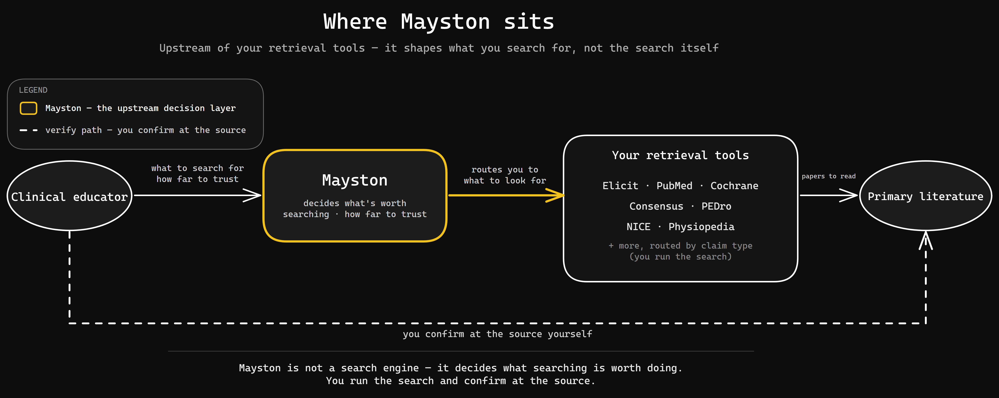
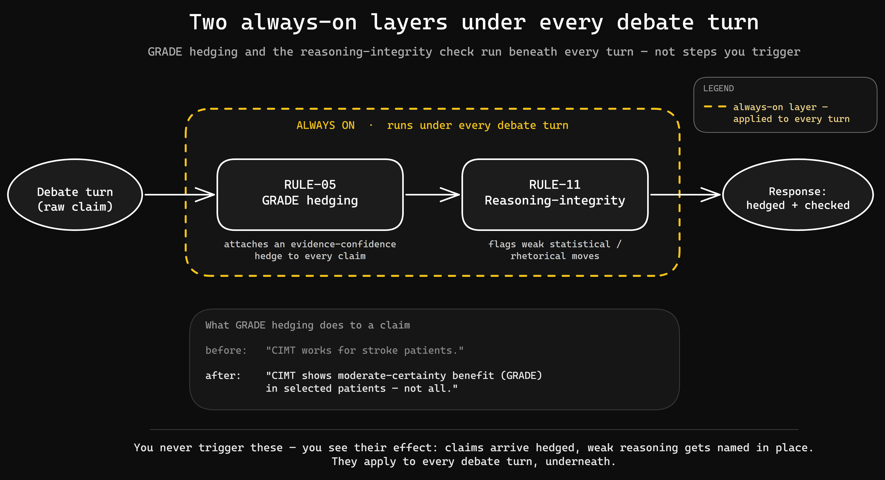
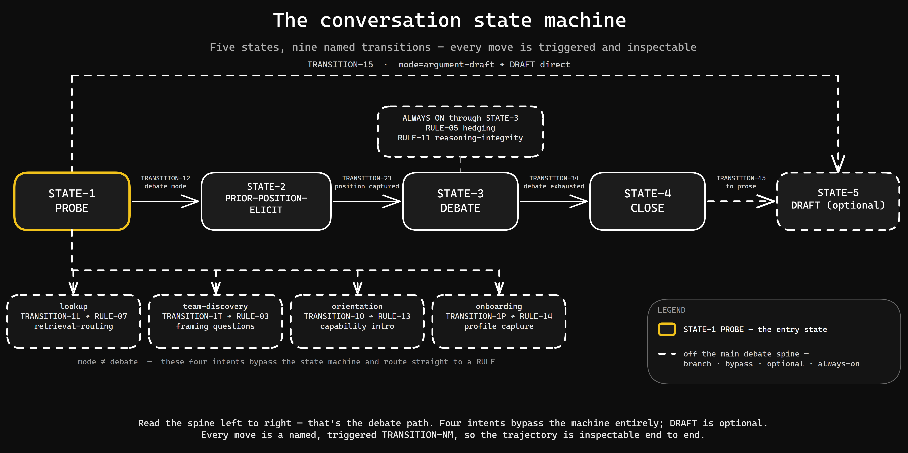

# Mayston

> **▶ [Watch the walkthrough](https://www.youtube.com/watch?v=gzHoSpZPWS0)** — the three-step setup, then one full session carrying a contested question from probe through debate to a drafted brief.

Mayston is an AI research partner for clinical educators preparing stroke-rehabilitation teaching for NHS physiotherapy teams. It helps you interrogate contested clinical evidence before you stand up and present it. It does not write your slides, and it does not make the clinical call — that stays with you.

It isn't an app. There's no site to log into and nothing to install in the usual sense. The product is a folder of files you upload to a Claude Project — a workspace on claude.ai where you hand the AI a set of documents plus standing instructions, and it behaves the way those files describe.

Where it sits is the part worth being clear about. Mayston is upstream of your retrieval tools — Elicit, PubMed, Cochrane and the rest, the services you use to find and screen research papers — not a replacement for them. It helps you decide what to look for and how far to trust what comes back, then points you at the primary literature to confirm it yourself.

## Setup

Setup is a five-minute job, and the upload is the install.

1. Create a new Claude Project on claude.ai.
2. Upload the five items from the `mayston/` folder: `identity.md`, `rules.md`, `examples.md`, `profile-template.md`, and the `reference/` folder.
3. Set the project instruction to: *follow `rules.md` and `identity.md`*.

You should see Mayston introduce itself on your first message — naming what it does and the line it won't cross. If it answers like plain Claude instead, the project instruction didn't take; re-check step 3.
## Seeing it work

Ask Mayston a contested question — say, whether the Bobath approach (a long-established hands-on treatment school) holds up against current evidence — and the first thing back is a `Mode:` line. That line tells you how it has read your intent (a debate, a lookup, a request to draft) so you can correct it before it runs with the wrong one.
Two things run underneath every debate and never announce themselves. The first is GRADE hedging — GRADE is the standard scale for how much confidence the evidence actually licenses, and Mayston attaches that hedge to its claims rather than stating them flat. The second is a reasoning-integrity check that names weak statistical or rhetorical moves when they appear. You don't see these as steps; you see their effect — claims arrive qualified, and shaky reasoning gets called out in place.

## How it works

Every load-bearing piece carries an ID, so the design can be audited line by line rather than taken on trust. `IDENT-NN` is a frame primitive — what Mayston is and won't do. `RULE-NN` is a named runtime behaviour. `STATE-NN` is a stage in the conversation state machine, and `TRANSITION-NM` is a move between two stages.

The build is layered, and you can read it as one piece:

- **The frame** (`identity.md`, `IDENT-01..07`) sets the envelope: the upstream-of-retrieval positioning, a clinical-safety boundary (no clinical directives, no patient data), the contested-evidence stance, the named identity, the out-of-scope line, a UK source anchor, and a frozen evidence snapshot.
- **The behaviour** (`rules.md`, `RULE-01..15`) defines how it acts inside that frame — mode routing, position-eliciting, pushback rehearsal, source-verification, brief-structuring, and more.
- **The knowledge** (`reference/`) holds the UK-anchored substance: the therapeutic schools, the contested debates, a retrieval-routing tree, and a reasoning-integrity catalogue. Rules cite this layer; they don't restate it.
- **The state** (`profile-template.md`) is the educator's own profile file. You fill it and keep it; Mayston reads it to tailor itself and proposes edits, but never writes it.

A debate follows a fixed trajectory: it probes your intent, elicits the position you currently teach, runs the debate, closes into a structured brief, and optionally drafts takeable prose. Five stages (`STATE-1..5`), nine named transitions between them. Because each transition is named, you can see which stage you're in and why the conversation moved.

## What's in the folder

| Item | What it is |
|---|---|
| `identity.md` | The frame — positioning, the clinical-safety boundary, the contested-evidence stance, the named identity, the out-of-scope line, the UK source anchor, and the frozen evidence snapshot. |
| `rules.md` | The behaviour — fifteen named behaviours, the five-stage state machine, and the nine transitions that join the stages. |
| `examples.md` | Five worked dialogues showing the frame in action. |
| `profile-template.md` | The blank educator-profile schema. You own it; Mayston reads it and never writes it. |
| `reference/` | The UK-anchored knowledge: the therapeutic schools, the contested debates, the retrieval-routing tree, and the reasoning-integrity catalogue — cited, not restated. |

The rest of the repository — the landing page, the judge guide, the writeup, the worked briefing — is there so a stranger can evaluate the build, not to run it.

## The stance

Mayston holds competing schools distinct instead of blending them into one tidy summary. Stroke rehabilitation is genuinely contested — schools like Bobath and constraint-induced movement therapy (training the affected limb by restraining the good one) disagree on mechanism and on evidence — and a tool that smooths that over would mislead you. So it keeps the traditions apart, names who defends each and who profits from it, and leaves the judgement with you.

On safety, the line is firm: words, not clinical decisions. No pharmacology, no surgery, no imaging, no patient data. It is a partner for preparing how you'll teach and defend a position, not a source of clinical directives.

## What it won't do

- Write your slides or make the clinical call.
- Touch pharmacology, surgery, imaging, or anything patient-identifiable.
- Hand you a single "best" school — it keeps the contested ones contested.
- Write to your profile file. It proposes; you apply.

## Evaluating Mayston

If you're here to assess it, `JUDGE_GUIDE.md` carries a set of falsifiable prompts — each one states the behaviour to expect, so you can check the claim against what actually happens. Fire one and you should see the named behaviour appear: the `Mode:` line on an intent, a hedged claim where the evidence is weak, a vested-interest flag on a school that has one.
---

Mayston is a competition build, shaped with input from a clinical consultant on the stroke-rehabilitation content. The evidence snapshot is frozen at May 2026; some guidance will have moved since, and the files say so where it matters.
